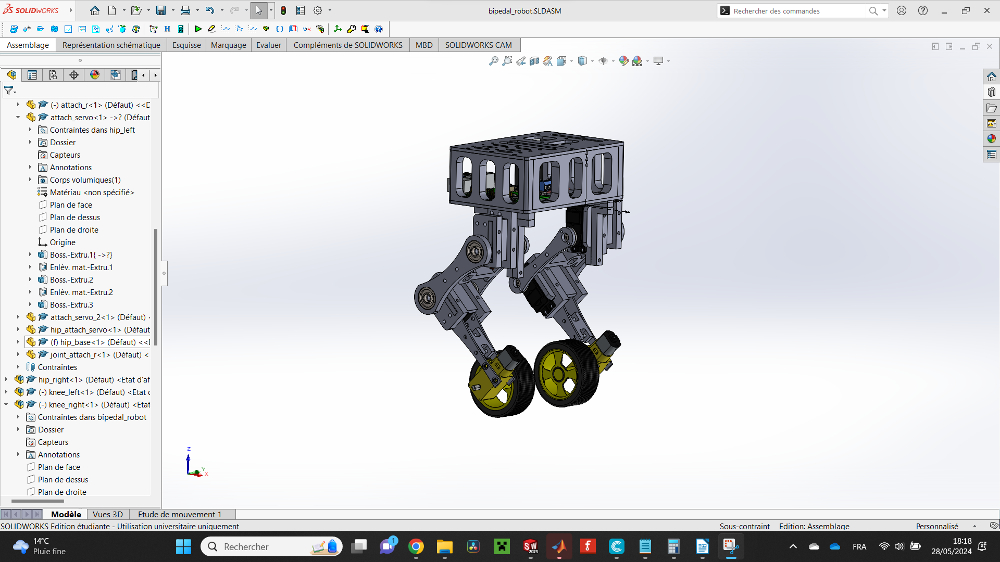

# Bipedal Wheeled Robot

## Hardware

Modelized on Solidworks, every parts are to be 3d printed. And this is the list of the material : 

 - 4 Servo Motors : Miuzei MG996r
 - 2 DC Motor Arduino with encoder
 - 2 Wheels
 - 1 Raspberry Pi OR Jetson Nano
 - 1 IMU
 - 1 L298N driver
 - 4 bearrings
 - M3, M4 and M5 bolts and nuts




## Software

Programmed using ROS2 and python. Created 4 packages.

### Package servo_controller

Subscribe from a topic name 'servo_command' and get an information under the format : "angle_hl:angle_hr:angle_kl:angle_kr"

To test it, open a first terminal and type :

```
cd GO/TO/PATH/Bipedal_Work/ros2_bipedal_ws/
source /opt/ros2/humble/setup.bash
source install/setup.bash
ros2 run servo_controller servo_controller_node
```

And in a second one :
```
cd GO/TO/PATH/Bipedal_Work/ros2_bipedal_ws/
source /opt/ros2/humble/setup.bash
source install/setup.bash
ros2 topic pub /servo_command std_msgs/msg/String "{data: "90:90:90:90"}"
```

### Package mpu_publishers

Publish on a topic name 'mpu9250_data' or 'mpu6050_data', depending on the one you used the information received by the sensor.

To install the libraries being used :

```
sudo apt-get update
sudo apt-get install python3-pip
pip3 install smbus2
pip3 install mpu9250-jmdev
pip3 install mpu6050-raspberrypi
```

And make always sure : 

VCC (Power) to 3.3V or 5V Power Pin

GND (Ground) to Ground Pin

SCL (Clock) to GPIO Pin 3 (I2C1 SCL)

SDA (Data) to GPIO Pin 2 (I2C1 SDA)

To test it, open a first terminal and type :

```
cd GO/TO/PATH/Bipedal_Work/ros2_bipedal_ws/
source /opt/ros2/humble/setup.bash
source install/setup.bash
ros2 run mpu_publishers mpu[here the version you use]_publisher
```

And in a second one :
```
cd GO/TO/PATH/Bipedal_Work/ros2_bipedal_ws/
source /opt/ros2/humble/setup.bash
source install/setup.bash
ros2 topic echo /mpu[here the version you use]_data
```

### Package dc_controller

Subscribe from a topic name 'servo_command' and get an information under the format : "info_hl:info_r"

To test it, open a first terminal and type :

```
cd GO/TO/PATH/Bipedal_Work/ros2_bipedal_ws/
source /opt/ros2/humble/setup.bash
source install/setup.bash
ros2 run dc_controller dc_controller_node
```

And in a second one :
```
cd GO/TO/PATH/Bipedal_Work/ros2_bipedal_ws/
source /opt/ros2/humble/setup.bash
source install/setup.bash
ros2 topic pub /dc_command std_msgs/msg/String "{data: "2:-2"}"
```

### Package feedback_control

Use the three first packages to keep the robot well balanced.

To test it, open a terminal and type :

```
cd GO/TO/PATH/Bipedal_Work/ros2_bipedal_ws/
source /opt/ros2/humble/setup.bash
source install/setup.bash
ros2 run feedback_control balance
```

